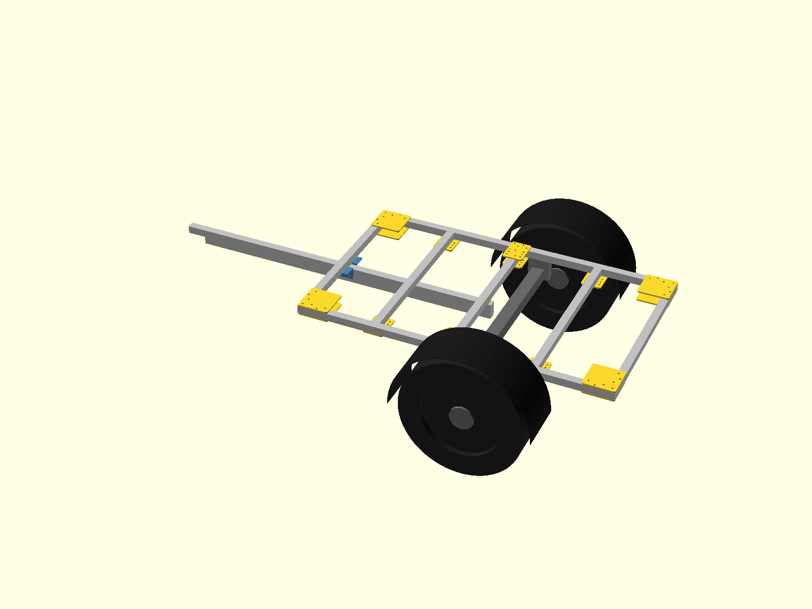
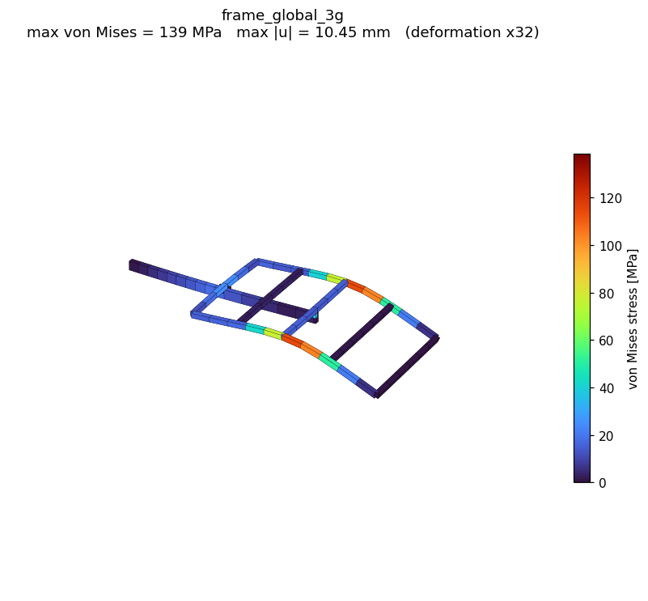
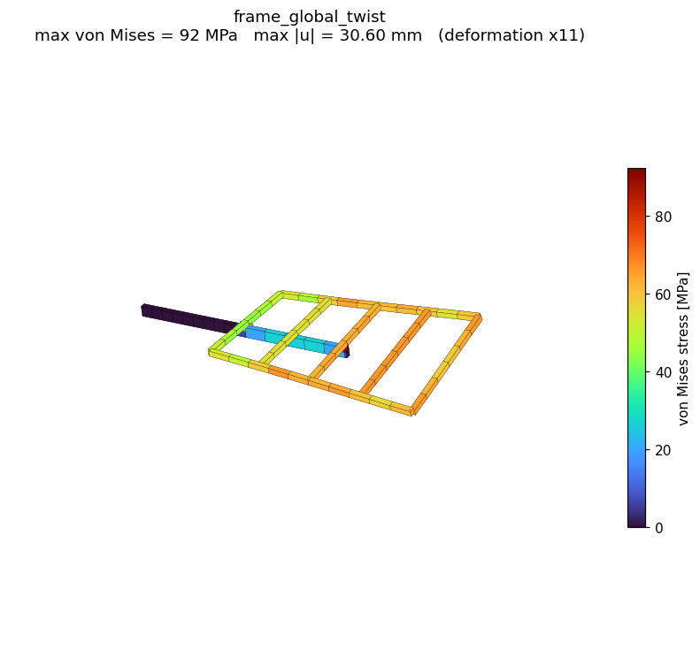
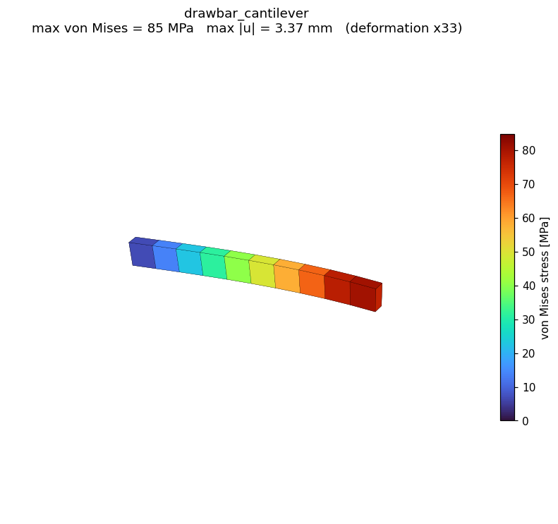
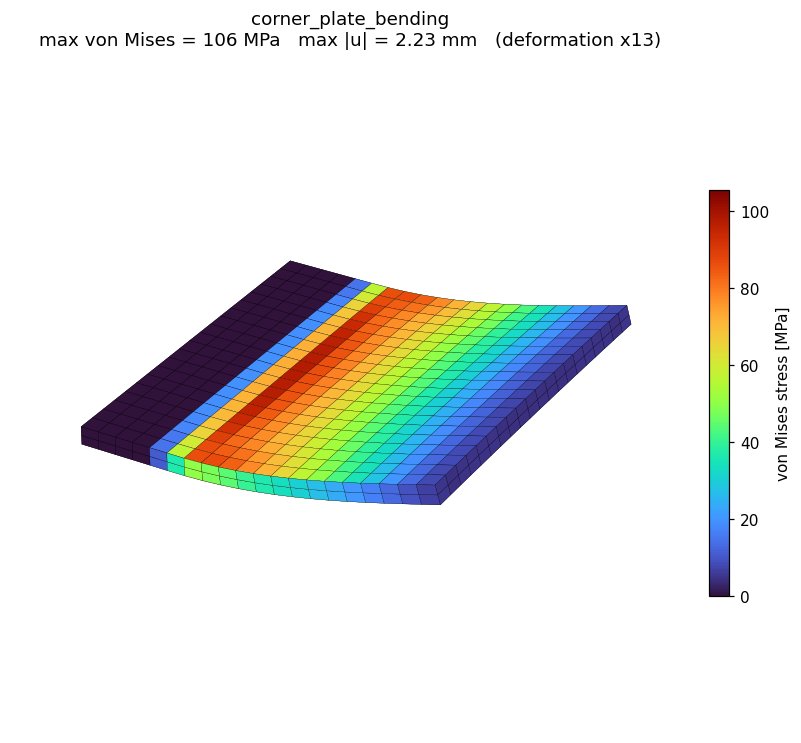
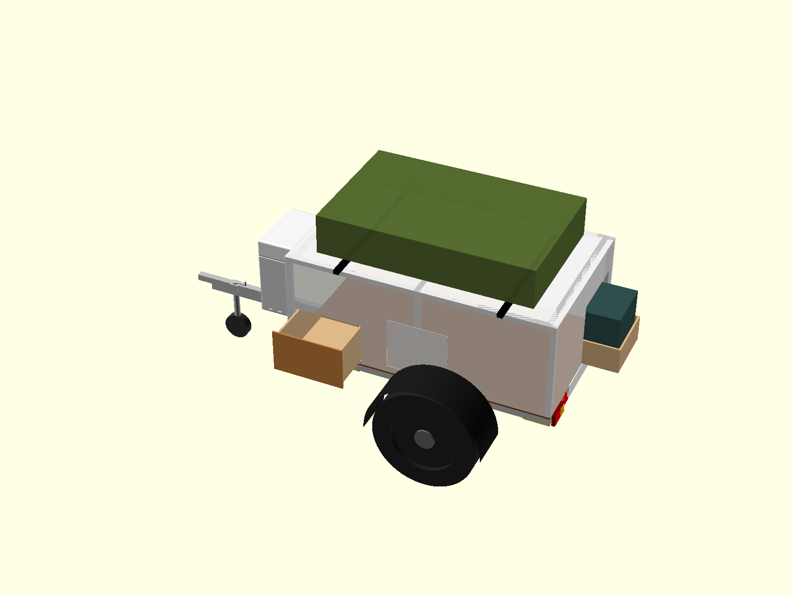
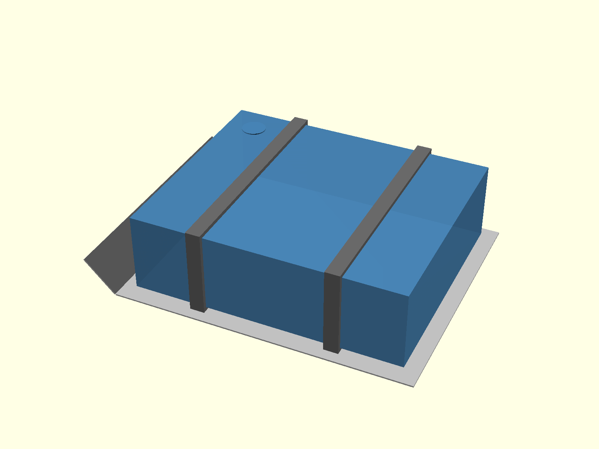

# PrintTrek

*The load-bearing core (what the project stands or falls on): 2000×1200 mm bolted VKR 50×50×3 frame with CNC-milled corner/T-plates, a single central VKR 100×50×4 drawbar lapped under the frame to a mid crossmember (clamped at the front, through-bolted at the rear), and a braked torsion axle matching the Ford Ranger's 1560 mm track. Sizing math lives in `scripts/beam_check.py` + `fea/`. Everything else (body, galley, systems) is ideation-stage layout on top of this chassis.*

## Structural Analysis

Hand-calcs (`python3 scripts/beam_check.py`) + CalculiX FEA, both validated against each other. Rebuild every derived artifact (FEA decks + solve + all renders + mass budget) on any machine with `scripts/regen_all.sh`, and gate commits with `scripts/verify_design.sh` (read-only: renders, deck drift, budget flags, FEA safety factors). FEA alone: `scripts/run_fea.sh` (needs `ccx`; renders need `pip install numpy matplotlib`). Materials: S355 steel for all VKR beams, 6082-T6 aluminum for all CNC-milled plates.

| | |
|---|---|
|  |  |
| **Whole chassis, 3g deck load** — rails 132 / crossbeams 26 / drawbar 19 MPa, **SF ≥ 2.7 on every member** (bounding: full 400 kg at 3g); front lap modeled as the L80×80×8 angle pair (4 MPa here — its governing case is the lateral couple, SF 3.0) | **Whole chassis, diagonal racking** (one corner lifted 30 mm) — 64/65 MPa; the bolted ladder frame is torsionally soft, which is what you want off-road |
|  |  |
| **Drawbar** (steel, 3g tongue load): 85 MPa at the root, SF ≈ 4 on yield — matches the hand calc | **Corner plate** (aluminum, prying bound): 106 MPa at the clamp line, SF ≈ 2.5 even with one plate taking the full couple |

The fatigue-governing detail is not the beam but the bolt hole at the front crossbeam lap (`check_joint_hole` in `beam_check.py`). The fix is a clamp joint with **no holes in the beam flanges**: two L80×80×8 steel angles (`cad/drawbar_angle_joint.scad`, budget option), a CNC-milled cradle (`cad/drawbar_cradle.scad`), or square U-bolts — same concept, pick by budget/tooling. Per-member tables and model notes in [`fea/README.md`](fea/README.md).

**PrintTrek** is an open-source, highly engineered, and modular offroad adventure trailer designed to be manufactured using a custom CNC router (like the PrintNC) and basic hand tools.

Built to traverse rugged terrain and function as an ultimate basecamp, PrintTrek eliminates the need for complex and fatigue-prone welding by utilizing a structural, bolted-together chassis. It is specifically designed to be the perfect companion for a mid-size pickup (like the Ford Ranger), matching its track width, wheel specs, and offroad capabilities.

## Project Goals

1. **Weld-Free Assembly:** Eliminate the barrier of entry and fatigue issues associated with welding. The entire frame is bolted together using through-bolts and heavy-duty, CNC-milled aluminum corner plates (the "double sandwich" method).
2. **Open Source & Maker-Friendly:** Provide complete, open-source CAD files and instructions so anyone with access to a CNC router (like a PrintNC) can mill the complex components themselves. Additionally, 3D printed drill guides will be provided for precise hole placement, and a simplified geometry version will be available for builders without CNC access.
3. **Extreme Durability:** Utilize hot-dip galvanized steel framing, 6082-T6 aluminum nodes, and strict galvanic corrosion protection to ensure the trailer survives decades of abuse in harsh environments.
4. **Safety & Separation of Systems:** Isolate electrical and network systems on the left side of the chassis, and the propane system entirely on the right side.
5. **Modularity:** Allow builders to customize the body panels (Dibond/plywood), electrical payload, and slide-out kitchen configuration without compromising the core structural integrity.

## Key Features

- **Tow-Vehicle Synchronization:** Matches the Ford Ranger's 6x139.7 bolt pattern and track width, allowing the use of shared spare wheels (e.g., 265/60R18 Falken Wildpeak A/T3W).
- **CNC-Optimized Design:** Heavily relies on flat-pack milled aluminum brackets, niches, and nodes that can be routed accurately at home.
- **Off-Grid Capabilities:**
  - 40L food-grade water tank centrally mounted with a 3mm aluminum skid plate.
  - Dedicated drawbar mount for a 6kg propane cylinder with built-in stone protection.
  - Recessed, milled niches for external water, gas, and power outlets.
  - Modular "Power Station" 12V box, 230V mains integration, and Teltonika 5G network integration.
- **Slide-Out Kitchen:** Accommodates a heavy-duty drawer (100-150kg slides) for a 12V compressor fridge (e.g., Dometic CFX), fed via an electrical-only energy chain. Propane stays on fixed pipes to external quick-connects for outdoor cooking.
- **CAN-Bus Control System:** Arduino-based CAN nodes (relays + sensors), a Go backend on a Raspberry Pi, and a web dashboard for monitoring water level, battery voltage, and temperature, and for switching the pump, lights, and fridge remotely.

## Design Snapshots (ideation-stage layout)

| | |
|---|---|
|  |  |
| **Full assembly concept** — kitchen side-drawer front left, storage cabinet mid left, electrical bay mid right, fridge drawer out the rear right | **Low-profile 40 L water tank** — 160 mm deep so the 3 mm skid plate sits level with the axle tube (~405 mm clearance); mounting under review, currently not in the assembly |

The body/galley layout is still being iterated and does not drive the structure. Renders are generated headlessly with `scripts/render_scad.sh cad/<model>.scad <output>.png` (chassis-only: add `-D show_cabin=false -D show_equipment=false`).

## Repository Structure

- `/cad`: Contains all the 3D models and manufacturing files (e.g., OpenSCAD, STEP, or STL files) for the corner plates, niches, and chassis geometry.
- `/concepts`: Markdown files and diagrams detailing sub-systems (like electrical routing, propane layout, and water flow).
- `/software`: The trailer control system — Arduino CAN-node firmware, Go backend (WebSocket API + CAN bridge), and web dashboard.
- `/scripts`: Helper tools — `calculate_tubes.py` (steel cut list from the CAD files) and `calculate_mass.py` (weight, center of gravity, and tongue-load budget).
- `MATERIALS.md`: A comprehensive Bill of Materials (BOM) detailing the steel, aluminum, fasteners, and specific off-the-shelf components required.
- `SPECS.md`: The core technical specifications and overarching design decisions.
- `TODO.md`: The phased checklist of design, purchasing, and construction tasks.

## How to Contribute or Build Your Own

Currently, the project is in the **Concept & CAD Design phase**. 

If you are interested in building your own PrintTrek, or want to contribute to the CAD models, electrical schematics, or documentation, feel free to fork this repository, open an issue, or submit a pull request!
